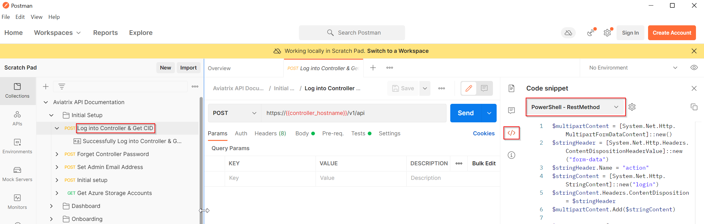
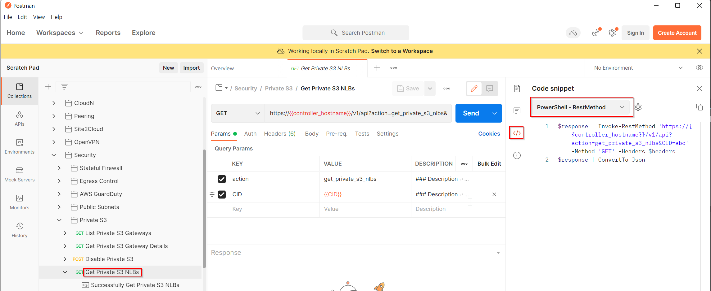
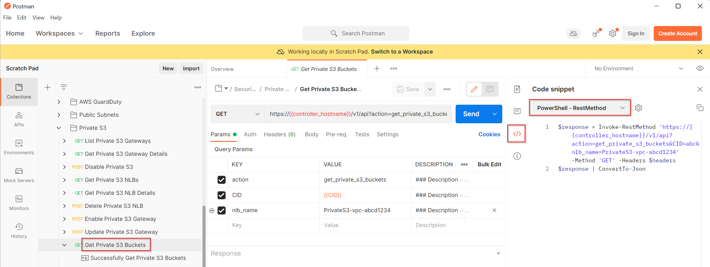
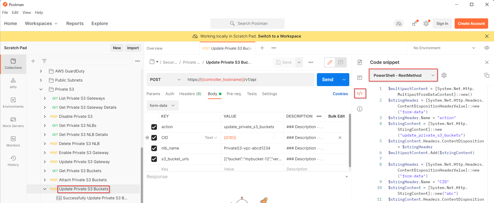

# PowerShell script to Auto Approve Private S3 Buckets

Environment variables:

Linux:

```
$ export AVIATRIX_CONTROLLER_IP = "1.2.3.4"
$ export AVIATRIX_USERNAME = "admin"
$ export AVIATRIX_PASSWORD = "password"
```


Requires PowerShell Core 7.x

The script **ps-avx-private-s3-auto-approval.ps1**  does the following:

1. Login to Aviatrix Controller and obtain CID
2. Obtain Private S3 NLBs 
3. Obtain S3 Buckets and set policy to allow, if they are not allowed already.

REST API reference:
1. Login to https://support.aviatrix.com/
2. Download postman collection that's corresponding to your Aviatrix controller version https://support.aviatrix.com/apiDownloads
3. Login to Aviatrix Controller to obtain CID, click on </> and pick your favourit language
  
4. Obtain Private S3 NLBs
  
5. Obtain list of S3 buckets
  
6. Within the code, update bucket "verdict" to "Allow"
7. Update Private S3 bucket policy
  


## Warning

**ps-avx-private-s3-random-policy.ps1** should only be used in pre-prod environment. This script randomly set the bucket to either New/Allow/Deny verdict.

**ps-avx-private-s3-auto-approval.ps1** is the main script to run.

## Logging

For any changes done, it will be logged each run under /changelogs subfolder.